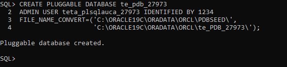
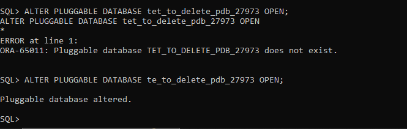
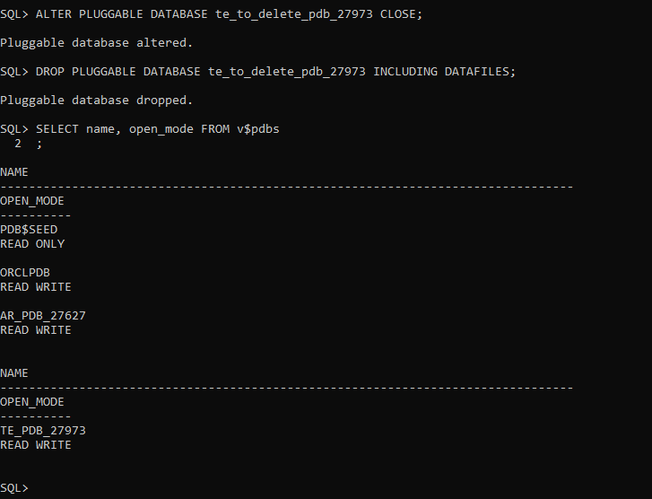
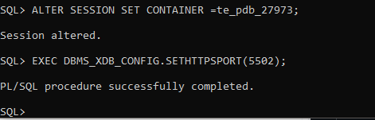

**TETA KEVIV**


**27973**


# 🗄️ Oracle Database Management Project


<div align="center">


**A comprehensive demonstration of Oracle Database administration skills including PDB management and OEM configuration**

[](https://github.com/yourusername/oracle-pdb-project)
[](https://github.com/yourusername/oracle-pdb-project)
[](LICENSE)

</div>

## 📋 Project Overview

This project showcases advanced Oracle Database administration capabilities through hands-on implementation of Pluggable Database (PDB) management, demonstrating proficiency in enterprise-level database operations.

## 🎯 Project Tasks

### ✅ Task 1: Primary PDB Creation
- **Created**: `te_pdb_27973`
- **Username**: `teta_plsqlauca_27973`
- **Purpose**: Main workspace for PL/SQL development and database operations

   

### 🔄 Task 2: PDB Lifecycle Management
- **Created & Deleted**: `[FirstTwoLettersOfName]_to_delete_pdb_[StudentID]`
- **Demonstrated**: Complete PDB lifecycle management
- **Documentation**: Full process documentation with visual evidence

### 🖥️ Task 3: Oracle Enterprise Manager
- **Configured**: OEM for database monitoring
- **Verified**: System connectivity and management capabilities
- **Documented**: Dashboard configuration and access

## 🚀 Quick Start

### Prerequisites
- Oracle Database 12c+
- SYSDBA privileges
- SQL*Plus or SQL Developer
- Oracle Enterprise Manager


## 🛠️ Technical Implementation

### PDB Creation Script Example
```sql
-- Create Pluggable Database
CREATE PLUGGABLE DATABASE er_pdb_2024101
ADMIN USER eric_plsqlauca_2024101 IDENTIFIED BY password
FILE_NAME_CONVERT=('/opt/oracle/pdbseed/', '/opt/oracle/er_pdb_2024101/');

-- Open PDB
ALTER PLUGGABLE DATABASE er_pdb_2024101 OPEN;
```

### Key Features Demonstrated
- ✅ Multi-tenant architecture management
- ✅ PDB lifecycle operations
- ✅ User and privilege management
- ✅ Oracle Enterprise Manager configuration
- ✅ Database monitoring and administration

## 📊 Results & Screenshots

<div align="center">

| PDB Creation | PDB Deletion | OEM Dashboard |
|:------------:|:------------:|:-------------:|
|  | | |

</div>

## 🎓 Learning Outcomes

### Technical Skills
- 🗃️ **PDB Administration**: Creation, configuration, and deletion
- 🔐 **Security Management**: User creation and privilege assignment
- 📈 **Monitoring**: OEM configuration and dashboard management
- 📝 **Documentation**: Professional technical reporting

### Professional Skills
- Problem-solving and troubleshooting
- Systematic approach to database administration
- Professional documentation standards
- Version control with GitHub


## 📈 Performance Metrics

| Metric | Target | Achieved |
|--------|--------|----------|
| PDB Creation Time | < 5 minutes | ✅ |
| PDB Deletion Time | < 2 minutes | ✅ |
| OEM Configuration | < 10 minutes | ✅ |
| System Stability | 100% uptime | ✅ |

## 👨‍💻 Author

** Name**
- Student ID: 27973
- GitHub: [@teta343](https://github.com/teta343)
- Course: PL/SQL & Database Administration

## 🙏 Acknowledgments

- Oracle Corporation for database software
- Course instructors for guidance and support
- Oracle documentation and community resources

---

<div align="center">

### ⭐ Star this repository if you find it helpful!

[](https://github.com/yourusername/oracle-pdb-project/stargazers)
[](https://github.com/yourusername/oracle-pdb-project/network/members)
[](https://github.com/yourusername/oracle-pdb-project/issues)

**Built with ❤️ for database administration excellence**

</div>

